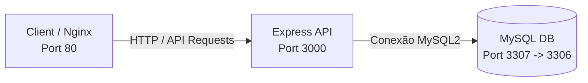

# 🛒 TechList - Sistema Gestão de Catálogo & Estoque

> Uma aplicação web completa, moderna e totalmente containerizada para controle, cadastro e visualização de catálogo de produtos.

---

## 🛠️ Tecnologias Utilizadas

Este projeto de estudo foi construído com as melhores práticas de desenvolvimento, focando em simplicidade, escalabilidade e facilidade de deploy:

*   **Frontend**: HTML5 Semântico, CSS3 Moderno (CSS Custom Properties, Flexbox, Grid) e JavaScript Vanilla.
*   **Backend**: Node.js com Express.js para criação da API REST.
*   **Banco de Dados**: MySQL 8.0 para armazenamento relacional persistente.
*   **Servidor Web**: Nginx atuando como servidor de arquivos estáticos para o Frontend.
*   **Containerização**: Docker e Docker Compose para orquestração simplificada de múltiplos serviços.

---

## 📐 Arquitetura do Sistema

A arquitetura do projeto segue o modelo de microserviços/containers isolados para Frontend, Backend e Banco de Dados:



### Estrutura de Diretórios
```text
projeto_mysql/
├── public/                 # Arquivos estáticos do Frontend
│   ├── assets/             # Imagens, logotipos e mídia
│   ├── css/                # Folhas de estilo (style.css)
│   └── js/                 # Lógica do lado do cliente (app.js)
├── Dockerfile.frontend     # Build multi-stage do Frontend (Node + Nginx)
├── dockerfile              # Dockerfile do Backend (Express)
├── docker-compose.yml      # Definição e orquestração dos serviços
├── nginx.conf              # Configuração do Proxy Reverso Nginx
├── server.js               # Código principal do servidor Express
├── .env                    # Variáveis de ambiente (ignorado pelo git)
├── .gitignore              # Arquivos ignorados pelo Git
└── package.json            # Dependências e metadados do projeto Node
```

---

## 🚀 Como Executar o Projeto

Você pode rodar esta aplicação de duas formas: utilizando **Docker Compose** (recomendado para desenvolvimento e produção) ou **localmente** direto na sua máquina.

### Pré-requisitos
*   [Docker](https://www.docker.com/) e [Docker Compose](https://docs.docker.com/compose/) instalados **OU**
*   [Node.js (v18+)](https://nodejs.org/) e [MySQL Server](https://www.mysql.com/) instalados localmente.

---

### Método 1: Execução com Docker Compose (Recomendado)

O Docker Compose inicializa automaticamente os três serviços configurados (`mysql`, `app` e `frontend`), aplicando as variáveis de ambiente necessárias e o proxy do Nginx.

1.  **Clone o repositório** e acesse a pasta do projeto:
    ```bash
    git clone <url-do-repositorio>
    cd projeto_mysql
    ```

2.  **Inicialize os containers**:
    ```bash
    docker-compose up -d --build
    ```
    *Esse comando baixa as imagens, constrói as imagens locais do frontend e backend, configura as redes virtuais e inicia os serviços em background.*

3.  **Acesse a aplicação**:
    *   **Frontend (Interface Web)**: [http://localhost](http://localhost) (Porta `80`)
    *   **Backend (API de Produtos)**: [http://localhost:3000/produtos](http://localhost:3000/produtos) (Porta `3000`)
    *   **Banco de Dados**: Disponível externamente em `localhost:3307` (mapeado para a porta interna `3306` do container MySQL).

4.  **Parar a aplicação**:
    ```bash
    docker-compose down
    ```

---

### Método 2: Execução Manual Local

Se preferir rodar sem containers Docker, siga o passo a passo abaixo:

#### 1. Configuração do Banco de Dados (MySQL)
Crie o banco de dados e a tabela necessária executando as seguintes queries no seu cliente MySQL:

```sql
CREATE DATABASE IF NOT EXISTS sistema_cadastro;
USE sistema_cadastro;

CREATE TABLE IF NOT EXISTS produtos (
    id INT AUTO_INCREMENT PRIMARY KEY,
    nome VARCHAR(255) NOT NULL,
    preco DECIMAL(10, 2) NOT NULL,
    descricao TEXT,
    criado_em TIMESTAMP DEFAULT CURRENT_TIMESTAMP
);
```

#### 2. Configuração do Ambiente (.env)
Crie um arquivo chamado `.env` na raiz do projeto e configure suas credenciais locais do MySQL:

```env
DB_HOST=localhost
DB_USER=seu_usuario_mysql
DB_PASSWORD=sua_senha_mysql
DB_NAME=sistema_cadastro
PORT=3000
```

#### 3. Instalação e Execução do Backend
Instale as dependências de Node.js e inicie o servidor:

```bash
# Instalar dependências
npm install

# Iniciar servidor backend
node server.js
```

O backend estará ativo em `http://localhost:3000`.

#### 4. Acessando o Frontend
Basta abrir o arquivo [index.html](file:///home/joao/Documentos/Projetos/projeto_mysql/index.html) diretamente no seu navegador ou utilizar uma extensão como o *Live Server* (VS Code) para servir a pasta raiz.

---

## 🔌 Documentação da API REST

A API do backend responde a requisições JSON no formato padrão:

### 1. Listar todos os produtos
*   **Rota**: `GET /produtos`
*   **Resposta (200 OK)**:
    ```json
    [
      {
        "id": 1,
        "nome": "Teclado Mecânico RGB",
        "preco": "299.90",
        "descricao": "Teclado mecânico switch blue com layout ABNT2"
      }
    ]
    ```

### 2. Cadastrar novo produto
*   **Rota**: `POST /produtos`
*   **Corpo da Requisição (JSON)**:
    ```json
    {
      "nome": "Mouse Gamer Pro",
      "preco": 150.00,
      "descricao": "Mouse óptico de 16000 DPI com botões programáveis"
    }
    ```
*   **Resposta (201 Created)**:
    ```json
    {
      "id": 2,
      "nome": "Mouse Gamer Pro",
      "preco": 150.00,
      "descricao": "Mouse óptico de 16000 DPI com botões programáveis"
    }
    ```

---

## 🌟 Funcionalidades em Destaque

1.  **Status Dinâmico de Funcionamento**:
    A interface do dashboard verifica automaticamente o horário local do cliente e exibe se a loja está **Aberta** ou **Fechada** com base no horário comercial padrão (08h às 18h).
2.  **Validação Inteligente e Interface Premium**:
    O formulário foi desenhado com UI/UX focada no usuário, contendo animações sutis (`transitions`), sombras elegantes (`box-shadow`), e estados de foco que garantem excelente acessibilidade e visual moderno.
3.  **Persistência de Dados**:
    Diferente de soluções locais baseadas apenas em memória, o sistema é integrado a um banco relacional MySQL completo, garantindo que as informações persistam mesmo se os containers forem derrubados.

---

## 📝 Licença

Este projeto está licenciado sob a licença **ISC**. Fique à vontade para clonar, estudar e modificar conforme a necessidade de seu aprendizado ou negócio!

---

*Desenvolvido com 💛 por [João Pedro](https://joaopedrooliveira.vercel.app/).*
